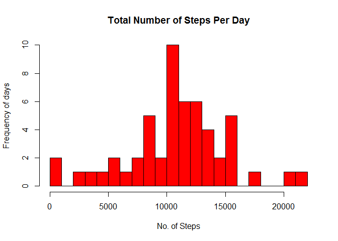
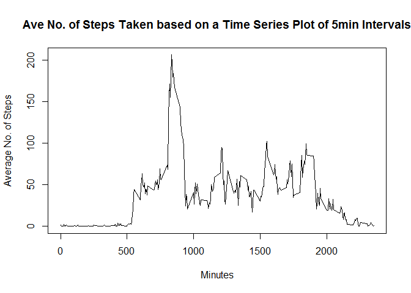
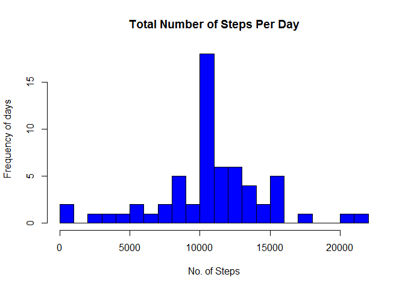

# Reproducible Research: Peer Assessment 1
Maggie Lim  
## Loading and preprocessing the data

```r
unzip(zipfile="activity.zip")
data <- read.csv(file="activity.csv", header=TRUE)
#Removes missing values and store in new data frame
data.na.omit <- na.omit(data)
```

## What is mean total number of steps taken per day?

####Calculate total number of steps taken per day

```r
library(plyr)
totalsteps = ddply(data.na.omit, .(date), summarize, steps = sum(steps))
```

####Plot Histogram

```r
hist(totalsteps$steps, breaks=30,
     main="Total Number of Steps Per Day", 
     xlab="No. of Steps", ylab="Frequency of days",
     col="red") 
```

 

####Mean total number of steps taken per day

```r
mean(totalsteps$steps)
```

```
## [1] 10766.19
```

####Median total number of steps taken per day

```r
median(totalsteps$steps)
```

```
## [1] 10765
```

## What is the average daily activity pattern?

####Calculate mean number of steps taken daily based on the 5min intervals and plot graph

```r
aveDaily = ddply(data.na.omit , .(interval), summarise, steps=mean(steps))
plot(aveDaily$interval, aveDaily$steps, type="l",
     main="Ave No. of Steps Taken based on a Time Series Plot of 5min Intervals",
     xlab="Minutes",
     ylab="Average No. of Steps")
```

 

####The 5-minute interval which contains the maximum number of steps

```r
aveDaily[which.max(aveDaily$steps),]   
```

```
##     interval    steps
## 104      835 206.1698
```

## Imputing missing values

####Total number of missing values in the dataset

```r
sum(is.na(data))
```

```
## [1] 2304
```

####Replace NA with mean for that day and created a new data set

```r
data2 <- data
for (i in 1:nrow(data2)) {
        if (is.na(data2$steps[i])) {
                data2$steps[i] <- aveDaily$steps[which(data2$interval[i] == aveDaily$interval)]                                                        
        }
}
```

####Calculate total number of steps taken per day for new data set and plot histogram

```r
totalsteps2 = ddply(data2, .(date), summarize, steps = sum(steps))
#Plot Histogram
hist(totalsteps2$steps, breaks=30,
     main="Total Number of Steps Per Day", 
     xlab="No. of Steps", ylab="Frequency of days",
     col="blue")   
```

 

####Mean total number of steps taken per day

```r
mean(totalsteps2$steps)
```

```
## [1] 10766.19
```

####Median total number of steps taken per day

```r
median(totalsteps2$steps)
```

```
## [1] 10766.19
```

#####These mean and median do not differ significantly from the previous mean and median.But imputing missing values to the data, the only impact was an increase in the total number of observations.

## Are there differences in activity patterns between weekdays and weekends?

#### Assigning weekends and weekdays

```r
data2$date <- as.Date(strptime(data2$date, format="%Y-%m-%d"))
data2$day <- weekdays(data2$date)   ##Create a 'day' column 

#Assigning weekends and weekdays
data2$day <- weekdays(data2$date)    
for (i in 1:nrow(data2)) {                                
        if (data2$day[i] %in% c("Saturday","Sunday")) { #if Saturday or Sunday, assign 'weekend' 
                data2$day[i]<-"weekend"                       
        }
        else{
                data2$day[i]<-"weekday"                 #else 'weekday'
        }
}
```

####Create time series plot for weekdays and weekends

```r
aveDaily2 <- ddply(data2, .(interval, day), summarise, steps=mean(steps))

library(lattice)
xyplot(steps ~ interval | day, data = aveDaily2, 
       layout = c(1, 2), type="l",
       xlab = "Interval", ylab = "Number of steps")
```

 

#####There is higher activity in the first 1000mins duing the weekday compared to the weekend. However, activity after 1000min is higher per interval during the weekend compared to the weekday. 
